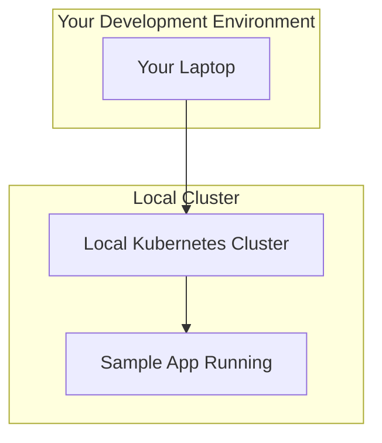
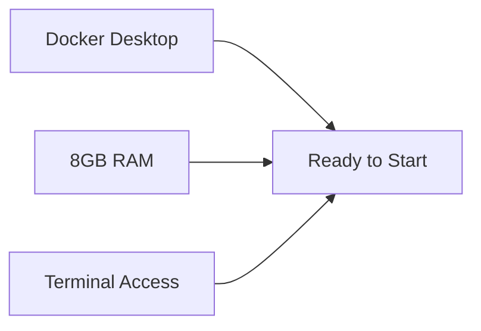
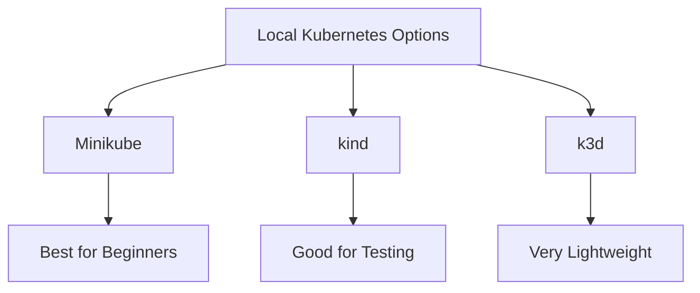

# Local Kubernetes Setup

This guide will help you set up a local Kubernetes cluster for development. We'll start small and build up step by step.

## What We're Building

Here's what we'll set up:



## Prerequisites

Before we start, you'll need:


1. Docker Desktop
   - Install from [docker.com](https://www.docker.com/products/docker-desktop)
   - Make sure it's running
   - Check with: `docker --version`

2. System Resources
   - 8GB RAM minimum (16GB recommended)
   - Check Activity Monitor (Mac) or Task Manager (Windows)

3. Terminal/Command Prompt
   - Mac: Terminal.app or iTerm
   - Windows: PowerShell or Command Prompt

## Choose Your Kubernetes Tool

You have three options for running Kubernetes locally. Let's compare them:



Pick one option - we recommend Minikube for beginners:

### 1. Minikube (Recommended for Beginners)
- Easiest to set up
- Good documentation
- Built-in addons

```bash
# Install Minikube
brew install minikube   # macOS
choco install minikube  # Windows

# Start cluster
minikube start --memory=4096 --cpus=2

# Enable ingress
minikube addons enable ingress
```

### 2. kind (Kubernetes in Docker)
- Lightweight
- Good for testing
- Multi-node support

```bash
# Install kind
brew install kind   # macOS
choco install kind  # Windows

# Create cluster
kind create cluster --name my-cluster
```

### 3. k3d
- Very lightweight
- Fast startup
- Built-in registry

```bash
# Install k3d
brew install k3d   # macOS
choco install k3d  # Windows

# Create cluster
k3d cluster create my-cluster
```

## First Steps

After installing, try these commands:

```bash
# Check if kubectl is installed
kubectl version

# See your nodes
kubectl get nodes

# Check system pods
kubectl get pods -n kube-system
```

## Basic Concepts

### 1. Pods
- Smallest unit in Kubernetes
- Can have one or more containers
- Share network and storage

```bash
# List pods
kubectl get pods

# Get pod details
kubectl describe pod <pod-name>
```

### 2. Services
- Network abstraction
- Load balancing
- Service discovery

```bash
# List services
kubectl get services

# Access a service
kubectl port-forward service/<service-name> 8080:80
```

### 3. Deployments
- Manage pod replicas
- Handle updates
- Self-healing

```bash
# List deployments
kubectl get deployments

# Scale a deployment
kubectl scale deployment/<name> --replicas=3
```

## Test Your Setup

First, let's verify your cluster with a simple test:

```bash
# Create a namespace
kubectl create namespace test

# Run nginx
kubectl run nginx --image=nginx -n test

# Expose it
kubectl expose pod nginx --port=80 -n test

# Test access
kubectl port-forward pod/nginx 8080:80 -n test
```

Visit http://localhost:8080 in your browser to verify nginx is working.

## Deploy the Sample Application

Now let's try deploying our sample task management application from the `/app` directory:

1. Create a namespace for our app:
```bash
kubectl create namespace task-manager
```

2. Deploy the application components:
```bash
# From the root directory of this project
kubectl apply -f app/kubernetes/ -n task-manager
```

3. Once deployed, you should be able to access:
- Frontend: http://localhost:3000 (React dev server)
- Backend API: http://localhost:3001

Note: The actual deployment configuration will be covered in detail in the Helm charts section.

## Common Issues

### 1. Docker Issues
- Make sure Docker is running
- Check available resources
- Restart Docker if needed

### 2. Cluster Creation
- Verify memory settings
- Check error messages
- Try with default settings first

### 3. kubectl Connection
- Check cluster status
- Verify configuration
- Try restarting cluster

## Next Steps

Once your cluster is running:
1. Try deploying the task app manually
2. Learn about Kubernetes resources
3. Practice basic commands

## Cheat Sheet

```bash
# Cluster
kubectl cluster-info         # Cluster information
kubectl get nodes           # List nodes
kubectl top nodes          # Node resource usage

# Resources
kubectl get pods           # List pods
kubectl get services       # List services
kubectl get deployments    # List deployments

# Namespaces
kubectl get namespaces     # List namespaces
kubectl create namespace   # Create namespace
kubectl delete namespace   # Delete namespace

# Debugging
kubectl logs <pod>         # View logs
kubectl exec -it <pod> sh  # Shell into pod
kubectl describe pod <pod> # Detailed pod info
```

## Getting Help

If you get stuck:
1. Check error messages
2. Review prerequisites
3. Ask during lab sessions

Remember:
- Start with basic commands
- Use --help for command info
- Practice in test namespace
- Ask questions when needed
