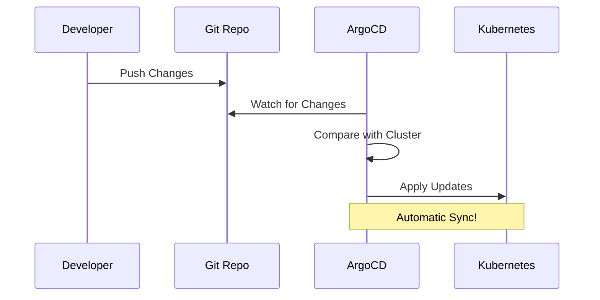
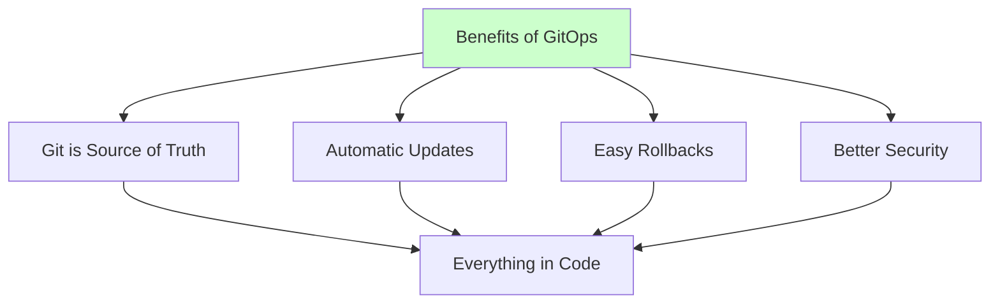
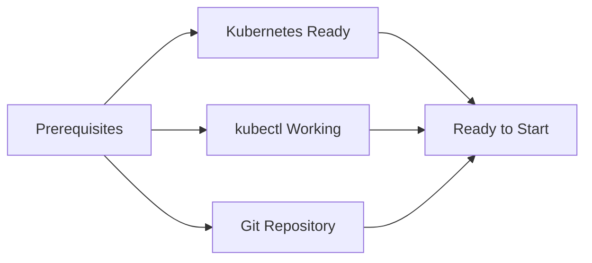

# Setting Up ArgoCD

This guide will help you implement GitOps using ArgoCD. We'll explain what GitOps is and why it's useful!

## Understanding GitOps

GitOps is a way to automatically update your application:



Think of it like this:
1. You update code in Git
2. ArgoCD notices the change
3. ArgoCD updates Kubernetes
4. Everything stays in sync!

## Why Use GitOps?



## Before We Start

Let's check what we need:



1. Working Kubernetes Cluster
   - From previous guides
   - Check with: `kubectl cluster-info`

2. kubectl Configured
   - Should be pointing to your cluster
   - Check with: `kubectl get nodes`

3. Git Repository
   - With your Helm charts
   - From GitLab CI guide

## Installing ArgoCD

### 1. Create Namespace
```bash
# Create ArgoCD namespace
kubectl create namespace argocd
```

### 2. Install ArgoCD
```bash
# Add Helm repo
helm repo add argo https://argoproj.github.io/argo-helm
helm repo update

# Install ArgoCD
helm install argocd argo/argo-cd \
  --namespace argocd \
  --set server.extraArgs={--insecure}
```

### 3. Access UI
```bash
# Port forward ArgoCD server
kubectl port-forward svc/argocd-server -n argocd 8080:443

# Get initial password
kubectl -n argocd get secret argocd-initial-admin-secret \
  -o jsonpath="{.data.password}" | base64 -d
```

Visit: http://localhost:8080
- Username: admin
- Password: (from above command)

## Setting Up the Sample Application

We'll configure ArgoCD to manage the task management application from the `/app` directory.

### 1. Create Application YAML
```yaml
apiVersion: argoproj.io/v1alpha1
kind: Application
metadata:
  name: task-app-dev
  namespace: argocd
spec:
  project: default
  source:
    repoURL: https://gitlab.com/your-username/task-app.git  # Your GitLab repository
    targetRevision: HEAD
    path: helm/task-app  # Path to your Helm chart
  destination:
    server: https://kubernetes.default.svc
    namespace: task-app-dev
  syncPolicy:
    automated:
      prune: true
      selfHeal: true

---
# ConfigMap for frontend configuration
apiVersion: v1
kind: ConfigMap
metadata:
  name: frontend-config
  namespace: task-app-dev
data:
  REACT_APP_API_URL: "http://localhost:3001/api"  # Backend API URL
```

Note: Make sure to:
1. Replace the repoURL with your GitLab repository URL
2. Update the frontend configuration to match the ports we're using (frontend: 3000, backend: 3001)

### 2. Apply Configuration
```bash
# Apply the application
kubectl apply -f application.yaml
```

### 3. Verify in UI
1. Open ArgoCD UI
2. Check application status
3. Watch sync process

## Understanding ArgoCD

### 1. Applications
- Represent a deployed app
- Points to Git repo
- Defines sync policy
```yaml
spec:
  source:
    repoURL: your-repo
    path: helm/task-app
  destination:
    namespace: task-app
```

### 2. Projects
- Group applications
- Define permissions
- Set constraints
```yaml
apiVersion: argoproj.io/v1alpha1
kind: AppProject
metadata:
  name: task-app
  namespace: argocd
```

### 3. Sync Policies
- How ArgoCD updates
- Auto or manual
- Pruning behavior
```yaml
syncPolicy:
  automated:
    prune: true    # Remove old resources
    selfHeal: true # Fix manual changes
```

## Common Operations

### 1. Manual Sync
```bash
# Using CLI
argocd app sync task-app-dev

# Or use UI:
# Click 'SYNC' button
```

### 2. View Resources
```bash
# Get application status
argocd app get task-app-dev

# Get detailed info
kubectl describe application task-app-dev -n argocd
```

### 3. View Logs
```bash
# Application logs
argocd app logs task-app-dev

# Specific container
argocd app logs task-app-dev -c frontend
```

## Common Issues

### 1. Sync Failed
- Check Git repository
- Verify credentials
- Review error messages
```bash
kubectl logs deployment/argocd-application-controller -n argocd
```

### 2. Access Issues
- Check port-forward
- Verify credentials
- Review RBAC
```bash
kubectl get pods -n argocd
kubectl get svc -n argocd
```

### 3. Application Not Updating
- Check sync policy
- Verify Git updates
- Review app status
```bash
argocd app get task-app-dev
```

## Commands Cheat Sheet

```bash
# ArgoCD CLI
argocd login localhost:8080     # Login to ArgoCD
argocd app list                # List applications
argocd app sync name          # Sync application
argocd app get name           # Get app details

# Kubernetes
kubectl get applications -n argocd  # List apps
kubectl get pods -n argocd         # Check ArgoCD pods
kubectl logs pod-name -n argocd    # View logs

# Context
kubectl config get-contexts        # List contexts
kubectl config use-context name    # Switch context
```

## Next Steps

1. Add more applications
2. Configure notifications
3. Set up SSO
4. Implement projects

## Getting Help

If you get stuck:
1. Check ArgoCD UI
2. Review application logs
3. Ask during lab sessions

Remember:
- Start with manual sync
- Test changes in dev first
- Monitor sync status
- Keep it simple!
